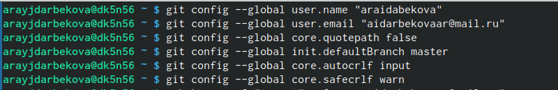
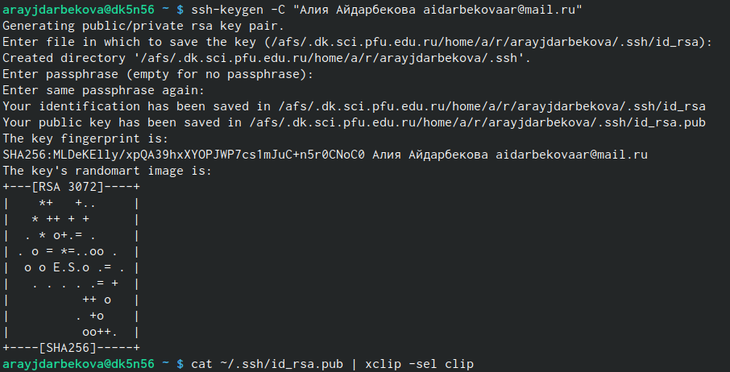
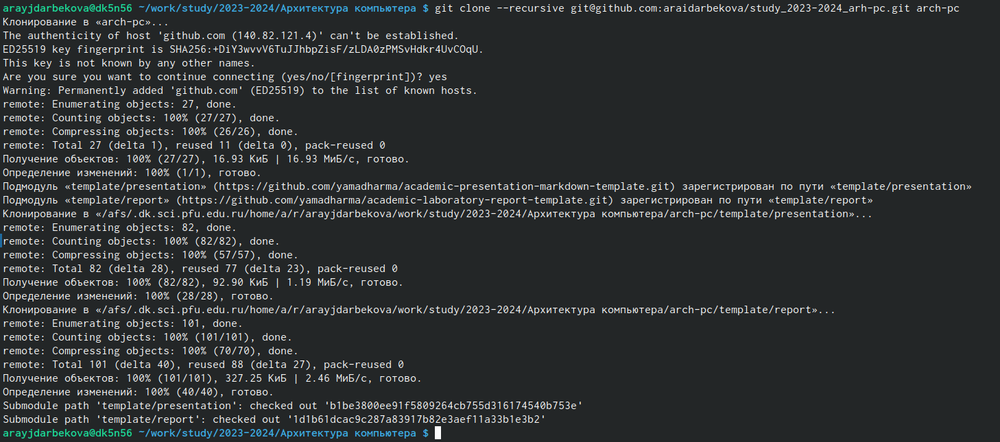
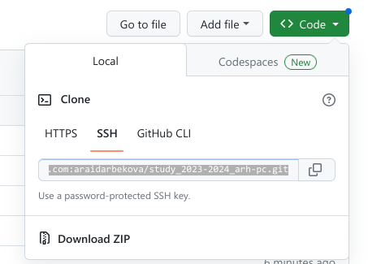
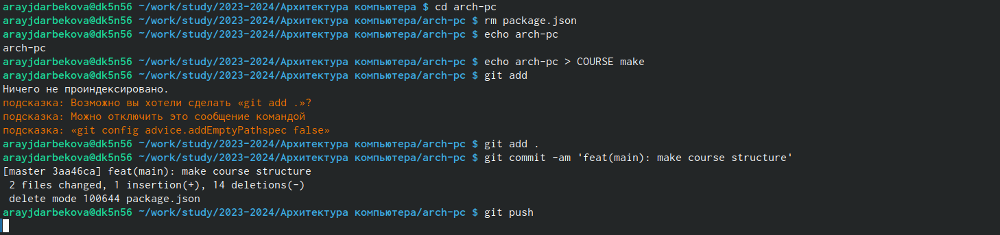

---
## Front matter
title: "Система контроля версий Git"
author: "Айдарбекова Алия Робертовна, НММбд-01-23"

## Generic otions
lang: ru-RU
toc-title: "Содержание"

## Bibliography
bibliography: bib/cite.bib
csl: pandoc/csl/gost-r-7-0-5-2008-numeric.csl

## Pdf output format
toc: true # Table of contents
toc-depth: 2
lof: true # List of figures
lot: true # List of tables
fontsize: 12pt
linestretch: 1.5
papersize: a4
documentclass: scrreprt
## I18n polyglossia
polyglossia-lang:
  name: russian
  options:
	- spelling=modern
	- babelshorthands=true
polyglossia-otherlangs:
  name: english
## I18n babel
babel-lang: russian
babel-otherlangs: english
## Fonts
mainfont: PT Serif
romanfont: PT Serif
sansfont: PT Sans
monofont: PT Mono
mainfontoptions: Ligatures=TeX
romanfontoptions: Ligatures=TeX
sansfontoptions: Ligatures=TeX,Scale=MatchLowercase
monofontoptions: Scale=MatchLowercase,Scale=0.9
## Biblatex
biblatex: true
biblio-style: "gost-numeric"
biblatexoptions:
  - parentracker=true
  - backend=biber
  - hyperref=auto
  - language=auto
  - autolang=other*
  - citestyle=gost-numeric
## Pandoc-crossref LaTeX customization
figureTitle: "Рис."
tableTitle: "Таблица"
listingTitle: "Листинг"
lofTitle: "Список иллюстраций"
lotTitle: "Список таблиц"
lolTitle: "Листинги"
## Misc options
indent: true
header-includes:
  - \usepackage{indentfirst}
  - \usepackage{float} # keep figures where there are in the text
  - \floatplacement{figure}{H} # keep figures where there are in the text
---

# Цель работы

Целью работы является изучить идеологию и применение средств контроля версий. Приобрести практические навыки по работе с системой git.

# Выполнение лабораторной работы

1. Создать аккаунт на сайте https://github.com/ 

2. Базовая настройка git.Сделаем предварительную конфигурацию git, указав имя и email с помозью команд git config --global user.name. Настраиваем utf-8, зададим имя начальной ветки 

{#fig:021 width=70%}

3. Создание SSH ключа. Сгенерируем пару ключей и загружаем сгенерированный открытый ключ на сайт.

{#fig:022 width=70%}

4. Сознание репозитория курса на основе шаблона. Клонируем созданный репозиторий.Копируем ссылку для клонирования 

{#fig:023 width=70%}

{#fig:024 width=70%}

5. Настройка каталога курса. Создаем необходимые каталоги, отправляем файлы на сервер:

{#fig:025 width=70%}

# Контрольные вопросы для самопроверки
1. Системы контрля версий  VCS применяются при работе нескольких человек над одни проектом. Они позволяют совмещать изменения, произведенные разными участниками проекта.
2. Хранилище – это система, обеспечивающая зранение всех существовавших версий файлов. Commit – запись изменений.История – список предыдущих изменений.Рабочая копия – копия файла, с которой непосредственно ведется работа.
3. В случае с централизованной VCS репозиторий хранится на одном сервере, и все разработчики работают с ним (например, CVS, Subversion). В децентрализованных (распределенных) системах центральный репозиторий не является обязательным (например, Git, Bazaar).

# Выводы

Создав аккаунт на github и разобравшись в нём, мы смогли добавить отчёты в общий доступ.

::: {#refs}
:::
