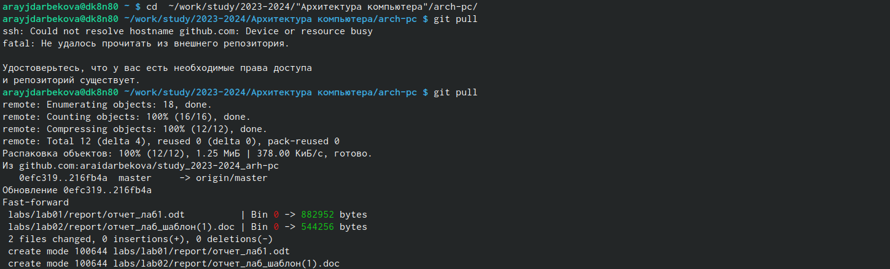
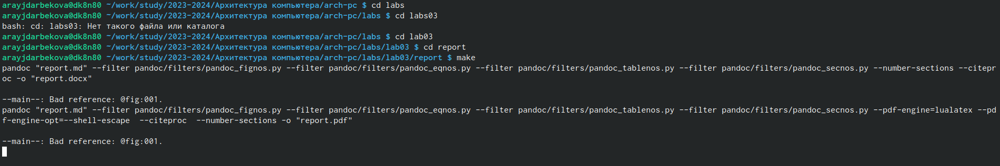
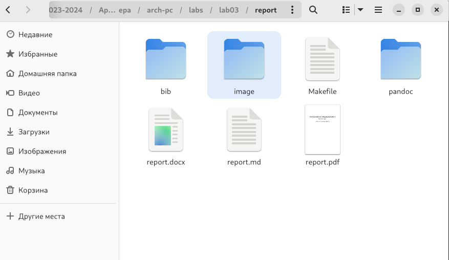
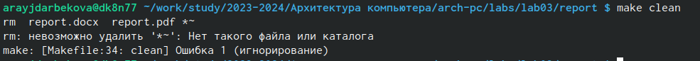
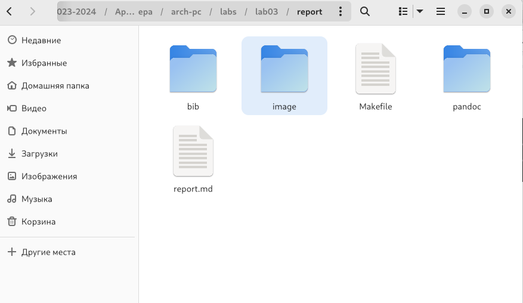
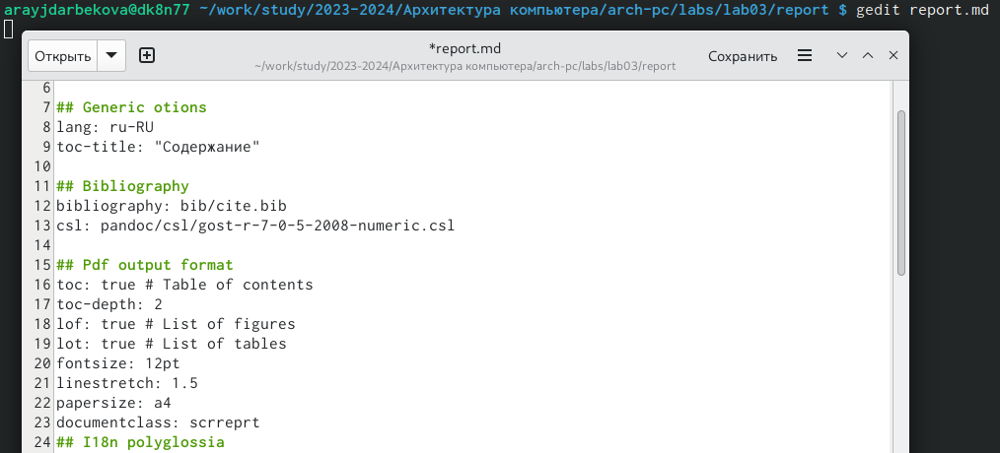

---
## Front matter
title: "Лабораторная работа №3. Язык разметки Markdown"
author: "Алия Робертовна Айдарбекова"

## Generic otions
lang: ru-RU
toc-title: "Содержание"

## Bibliography
bibliography: bib/cite.bib
csl: pandoc/csl/gost-r-7-0-5-2008-numeric.csl

## Pdf output format
toc: true # Table of contents
toc-depth: 2
lof: true # List of figures
lot: true # List of tables
fontsize: 12pt
linestretch: 1.5
papersize: a4
documentclass: scrreprt
## I18n polyglossia
polyglossia-lang:
  name: russian
  options:
	- spelling=modern
	- babelshorthands=true
polyglossia-otherlangs:
  name: english
## I18n babel
babel-lang: russian
babel-otherlangs: english
## Fonts
mainfont: PT Serif
romanfont: PT Serif
sansfont: PT Sans
monofont: PT Mono
mainfontoptions: Ligatures=TeX
romanfontoptions: Ligatures=TeX
sansfontoptions: Ligatures=TeX,Scale=MatchLowercase
monofontoptions: Scale=MatchLowercase,Scale=0.9
## Biblatex
biblatex: true
biblio-style: "gost-numeric"
biblatexoptions:
  - parentracker=true
  - backend=biber
  - hyperref=auto
  - language=auto
  - autolang=other*
  - citestyle=gost-numeric
## Pandoc-crossref LaTeX customization
figureTitle: "Рис."
tableTitle: "Таблица"
listingTitle: "Листинг"
lofTitle: "Список иллюстраций"
lotTitle: "Список таблиц"
lolTitle: "Листинги"
## Misc options
indent: true
header-includes:
  - \usepackage{indentfirst}
  - \usepackage{float} # keep figures where there are in the text
  - \floatplacement{figure}{H} # keep figures where there are in the text
---

# Цель работы

Целью работы является освоение процедуры оформления отчетов с помощью легковесного языка разметки Markdown.

# Задание

Здесь приводится описание задания в соответствии с рекомендациями
методического пособия и выданным вариантом.

# Теоретическое введение

Базовые сведения о Markdown

|   Команда                                   | Описание                                                                                                                   |
|---------------------------------------------|----------------------------------------------------------------------------------------------------------------------------|
| `#`                                         | Создание заголовка                                                                                                         |
| `**bold** `                                 | Полужирный шрифт                                                                                                           |
| `*italic*`                                  | Курсивный шрифт                                                                                                            |
| `***bai***`                                 | Полужирный и курсивный шрифт                                                                                               |
| `>`                                         | Блок цитирования                                                                                                           |
| `[link text]`                               | Текст гиперссылки                                                                                                          |
| `(file-name.md)`                            | URL-адрес или имя файла, на который дается ссылка                                                                          |
|`$\tg(x) = 1/ \ctg(x) $`                     | Для записи формул                                                                                                          |
| `$$ {#eq:eq1}`                              | Смотри формулу ({-eg.3.1})                                                                                                 |
| `[name]`                                    | Подпись к рисунку                                                                                                          |
| `(url/адрес.jpg "подсказка")`               | URL-адрес или относительный путь изображения,а также необязательную подсказку                                              |
| `{#fig:fig1 width=70%}`                     | Указывается идентификатор изображения для ссылки для него по тексту и размер изображения относительно ширины страницы      |

# Выполнение лабораторной работы

1. Обновляем локальный репозиторий, скачав изменения из удалённого репозитория
{#fig:001 width=70%}
2. Входим в каталог лабораторной работы №3 и проводим компиляцию шаблона
{#fig:002 width=70%}
{#fig:003 width=70%}
3. Теперь удаляем полученные файлы с использованием Makefile
{#fig:004 width=70%}
{#fig:005 width=70%}
4. Открываем файл report.md с помощью любоого текстового редактора
{#fig:006 width=70%}
5. Проверяем корректность и начинаем редакцию отчета под себя

# Выводы
С помощью команд я разобралась с языком разметки Markdown, благодаря чему я смогу быстрее и легче оформлять отчёты.

::: {#refs}
:::
