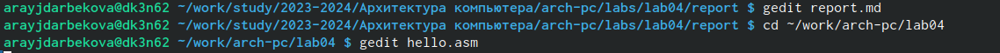
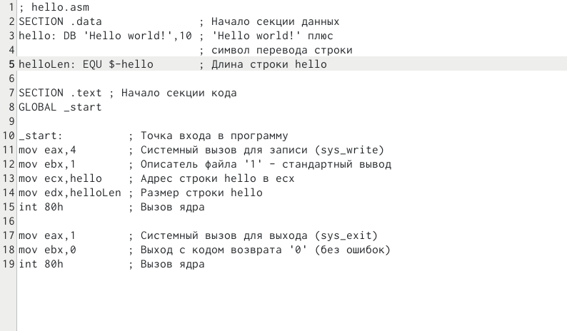
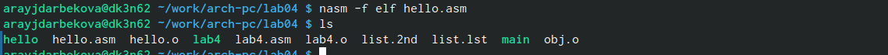
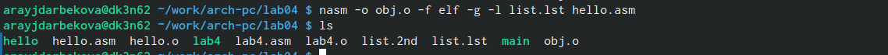
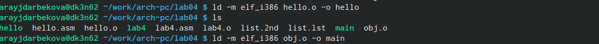
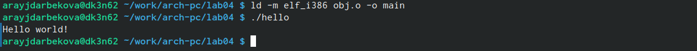
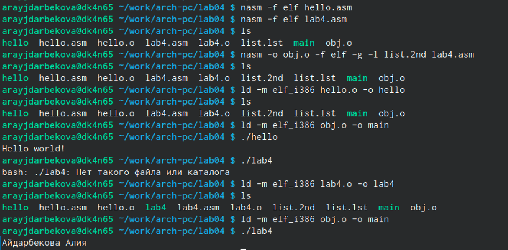

---
## Front matter
title: "Лабораторная работа №4. Создание и процесс обработки программ на языке ассемблера NASM"
subtitle: "Простейший вариант"
author: "Айдарбекова Алия НММбд-01-23"

## Generic otions
lang: ru-RU
toc-title: "Содержание"

## Bibliography
bibliography: bib/cite.bib
csl: pandoc/csl/gost-r-7-0-5-2008-numeric.csl

## Pdf output format
toc: true # Table of contents
toc-depth: 2
lof: true # List of figures
lot: true # List of tables
fontsize: 12pt
linestretch: 1.5
papersize: a4
documentclass: scrreprt
## I18n polyglossia
polyglossia-lang:
  name: russian
  options:
	- spelling=modern
	- babelshorthands=true
polyglossia-otherlangs:
  name: english
## I18n babel
babel-lang: russian
babel-otherlangs: english
## Fonts
mainfont: PT Serif
romanfont: PT Serif
sansfont: PT Sans
monofont: PT Mono
mainfontoptions: Ligatures=TeX
romanfontoptions: Ligatures=TeX
sansfontoptions: Ligatures=TeX,Scale=MatchLowercase
monofontoptions: Scale=MatchLowercase,Scale=0.9
## Biblatex
biblatex: true
biblio-style: "gost-numeric"
biblatexoptions:
  - parentracker=true
  - backend=biber
  - hyperref=auto
  - language=auto
  - autolang=other*
  - citestyle=gost-numeric
## Pandoc-crossref LaTeX customization
figureTitle: "Рис."
tableTitle: "Таблица"
listingTitle: "Листинг"
lofTitle: "Список иллюстраций"
lotTitle: "Список таблиц"
lolTitle: "Листинги"
## Misc options
indent: true
header-includes:
  - \usepackage{indentfirst}
  - \usepackage{float} # keep figures where there are in the text
  - \floatplacement{figure}{H} # keep figures where there are in the text
---

# Цель работы

Освоение процедуры компиляции и сборки программ, написанных на ассемблере NASM.

# Задание

Здесь приводится описание задания в соответствии с рекомендациями
методического пособия и выданным вариантом.

# Теоретическое введение
Язык ассмблера - машинно-ориентированный язык низкого уровня. Он больше всего приближен к архитектуре ЭВМ и её аппаратным возможностям. Это язык, с помощью которого пишутся команды для процессора понятным для человека образом. Следует отметить, процессор понимаеи машинные коды.
NASM - это открытый проект ассемблера, версии которого доступны под различные операционные системы и который позволяет получать объектные файлы для этих систем.
Типичный формат записи команд:
'[метка:] мнемокод [операнд {, операнд}] [;комментарий]'
Здесь мнемокод - непосредственно мнемоника инструкции процессору, являющейся обязательной частью команды.

# Выполнение лабораторной работы

1. Создаем каталог для работы с программами на языке ассемблера NASM и переходим туда. Далее создаем текстовый файл внутри и открываем его с помощью текстого редактора gedit 

{#fig:001 width=70%}

2. Вводим необходимый текст. Компилируем его.

{#fig:002 width=70%}

{#fig:003 width=70%}

3. Скомпилируем исходный файл в obj.o. Дополнительно будет создан файл листинга

{#fig:004 width=70%}

4. Передаем объектный файл на обработку компоновщику

{#fig:005 width=70%}

5. Запускаем на выполнение созданный файл

{#fig:006 width=70%}

#Задание для самостоятельной работы

1. Создаем копию файла

{#fig:007 width=70%}

2. С помощью текстового редактора меняем фразу Hello world! на свои фамилию и имя.

3. Оттранслируем полученный текст программы в объектный файл, выполняем компоновку и запускаем получившийся исполняемый файл.

{#fig:008 width=70%}

# Выводы

Мы познакомились с ассемблером и его проектом NASM. Освоили компиляцию программы, написанной на ассемблере.

