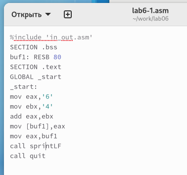
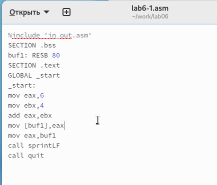
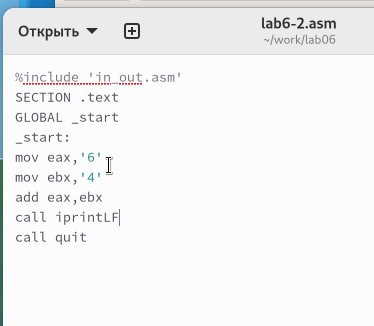
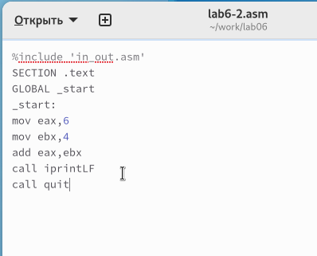
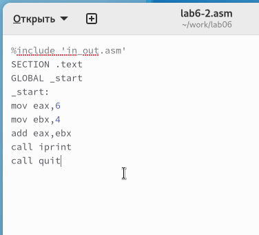
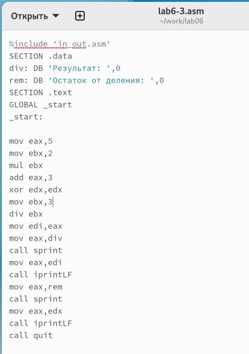
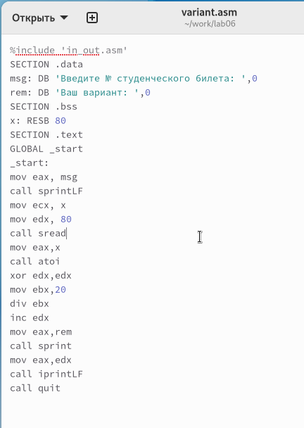
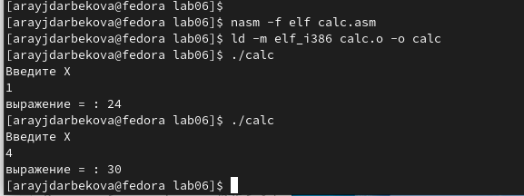

---
## Front matter
title: "Отчёт по лабораторной работе 6"
subtitle: "Дисциплина: архитектура компьютера"
author: "Айдарбекова Алия НММбд-01-23"

## Generic otions
lang: ru-RU
toc-title: "Содержание"

## Bibliography
bibliography: bib/cite.bib
csl: pandoc/csl/gost-r-7-0-5-2008-numeric.csl

## Pdf output format
toc: true # Table of contents
toc-depth: 2
lof: true # List of figures
lot: true # List of tables
fontsize: 12pt
linestretch: 1.5
papersize: a4
documentclass: scrreprt
## I18n polyglossia
polyglossia-lang:
  name: russian
  options:
	- spelling=modern
	- babelshorthands=true
polyglossia-otherlangs:
  name: english
## I18n babel
babel-lang: russian
babel-otherlangs: english
## Fonts
mainfont: PT Serif
romanfont: PT Serif
sansfont: PT Sans
monofont: PT Mono
mainfontoptions: Ligatures=TeX
romanfontoptions: Ligatures=TeX
sansfontoptions: Ligatures=TeX,Scale=MatchLowercase
monofontoptions: Scale=MatchLowercase,Scale=0.9
## Biblatex
biblatex: true
biblio-style: "gost-numeric"
biblatexoptions:
  - parentracker=true
  - backend=biber
  - hyperref=auto
  - language=auto
  - autolang=other*
  - citestyle=gost-numeric
## Pandoc-crossref LaTeX customization
figureTitle: "Рис."
tableTitle: "Таблица"
listingTitle: "Листинг"
lofTitle: "Список иллюстраций"
lotTitle: "Список таблиц"
lolTitle: "Листинги"
## Misc options
indent: true
header-includes:
  - \usepackage{indentfirst}
  - \usepackage{float} # keep figures where there are in the text
  - \floatplacement{figure}{H} # keep figures where there are in the text
---

# Цель работы

Целью работы является освоение арифметических инструкций языка ассемблера NASM.

# Задание

1. Изучение арифметический операций в ассемблере

2. Изучение типов данных в ассемблере

3. Выполнение заданий, рассмотрение примеров

5. Выполнение заданий для самостоятельной работы

# Теоретическое введение

Большинство инструкций на языке ассемблера требуют обработки операндов. Адрес операнда предоставляет место, где хранятся данные, подлежащие обработке. Это могут быть
данные хранящиеся в регистре или в ячейке памяти.

Схема команды целочисленного сложения add (от англ. addition - добавление) выполняет
сложение двух операндов и записывает результат по адресу первого операнда. 

Команда целочисленного вычитания sub (от англ. subtraction – вычитание) работает аналогично команде add.

Умножение и деление, в отличии от сложения и вычитания, для знаковых и беззнаковых
чисел производиться по-разному, поэтому существуют различные команды.
Для беззнакового умножения используется команда mul (от англ. multiply – умножение).

Для команд умножения один из сомножителей указывается в команде и должен находиться в регистре или в памяти, но не может быть непосредственным операндом. Второй
сомножитель в команде явно не указывается и должен находиться в регистре EAX,AX или
AL, а результат помещается в регистры EDX:EAX, DX:AX или AX, в зависимости от размера
операнда.

Для деления, как и для умножения, существует 2 команды div (от англ. divide - деление) и
idiv.

В командах указывается только один операнд – делитель, который может быть регистром
или ячейкой памяти, но не может быть непосредственным операндом. Местоположение
делимого и результата для команд деления зависит от размера делителя. Кроме того, так как
в результате деления получается два числа – частное и остаток, то эти числа помещаются в
определённые регистры 6.2.

# Выполнение лабораторной работы

## Символьные и численные данные в NASM

Я создала каталог для программ лабораторной работы № 6, перешла в него и создала файл lab6-1.asm.

Рассмотрим примеры программ вывода символьных и численных значений. 
Программы будут выводить значения, записанные в регистр eax.

В данной программе (рис. [-@fig:001]) в регистр eax записан символ 6 (mov eax,'6'), 
а в регистр ebx символ 4 (mov ebx,'4'). 
Затем прибавиляем значение регистра ebx к значению в регистре eax 
(add eax,ebx, результат сложения запишется в регистр eax). 
Затем вывод результата (рис. [-@fig:002]).

Так как для работы функции sprintLF в регистр eax должен быть записан адрес, 
использовуем дополнительную переменную. 
Записали значение регистра eax в переменную buf1 (mov [buf1],eax), а затем 
записали адрес переменной buf1 в регистр eax (mov eax,buf1) и вызвали функцию sprintLF.

{ #fig:001 width=70%, height=70% }

{ #fig:002 width=70%, height=70% }

В данном случае, при выводе значения регистра eax, 
я ожидала увидеть число 10. Однако, результатом был символ 'j'. 
Это произошло потому, что код символа 6 равен 00110110 в двоичном представлении 
(или 54 в десятичном представлении), а код символа 4 – 00110100 (52). 
Команда add eax,ebx записала в регистр eax сумму кодов – 01101010 (106), 
что в свою очередь является кодом символа 'j'.

Далее я изменила текст программы и вместо символов записала в регистры числа (рис. [-@fig:003])

{ #fig:003 width=70%, height=70% }

{ #fig:004 width=70%, height=70% }

В процессе выполнения программы мы не получили ожидаемое число 10. 
Вместо этого был выведен символ с кодом 10 (рис. [-@fig:004]). 
Это символ конца строки (возврат каретки), который в консоли не отображается, 
но добавляет пустую строку.

В файле in_out.asm реализованы подпрограммы для работы 
с числами и преобразования символов ASCII. 
Я модифицировала текст программы с использованием этих функций (рис. [-@fig:005]).

{ #fig:005 width=70%, height=70% }

{ #fig:006 width=70%, height=70% }

В результате выполнения обновленной программы было выведено число 106 (рис. [-@fig:006]). 
Здесь, как и в первом случае, команда add складывает коды символов ‘6’ и ‘4’ (54 + 52 = 106). 
Но в отличие от предыдущей версии, функция iprintLF позволяет напечатать само число, 
а не символ с соответствующим кодом.

По аналогии с предыдущим примером, я заменила символы на числа (рис. [-@fig:007]). 

{ #fig:007 width=70%, height=70% }

Функция iprintLF позволяет выводить числа, и на этот раз в качестве операндов 
использовались именно числа, а не коды символов. В результате мы получили число 10 (рис. [-@fig:008]).

{ #fig:008 width=70%, height=70% }

Далее я заменила функцию iprintLF на iprint, создала исполняемый файл и запустила его. 
Вывод теперь отличается отсутствием перехода на новую строку (рис. [-@fig:009]).

{ #fig:009 width=70%, height=70% }

{ #fig:010 width=70%, height=70% }

## Выполнение арифметических операций в NASM

 В качестве примера выполнения арифметических операций в NASM приведем 
программу вычисления арифметического выражения $$f(x) = (5 * 2 + 3)/3$$.
(рис. [-@fig:011]) (рис. [-@fig:012])

{ #fig:011 width=70%, height=70% }

{ #fig:012 width=70%, height=70% }

Изменила текст программы для вычисления выражения 
$$f(x) = (4 * 6 + 2)/5$$. 
Создал исполняемый файл и проверил его работу. (рис. [-@fig:013]) (рис. [-@fig:014])

{ #fig:013 width=70%, height=70% }

{ #fig:014 width=70%, height=70% }

В качестве еще одного примера давайте рассмотрим программу для вычисления варианта 
задания на основе номера студенческого билета.

В этом случае число, над которым нужно выполнять арифметические операции, 
вводится с клавиатуры. Как я уже отмечала ранее, ввод с клавиатуры осуществляется 
в символьном виде. Для корректной работы арифметических операций 
в NASM эти символы необходимо преобразовать в числовой формат. 
С этой целью можно использовать функцию atoi из файла in_out.asm 
(рис. [-@fig:015]) (рис. [-@fig:016]). 
Она конвертирует строку символов в эквивалентное decimal число.

{ #fig:015 width=70%, height=70% }

{ #fig:016 width=70%, height=70% }

### Ответы на вопросы по программе variant.asm

1. Какие строки листинга отвечают за вывод на экран сообщения ‘Ваш вариант:’?

Строки, отвечающие за вывод сообщения "Ваш вариант:", - это mov eax, rem для помещения 
фразы в регистр eax и call sprint для вызова подпрограммы вывода строки.

2. Для чего используется следующие инструкции?

- mov ecx, x - сохранение регистра ecx в переменной x

- mov edx, 80 - присваивание значения 80 регистру edx

- call sread - вызов подпрограммы для считывания данных из консоли

3. Для чего используется инструкция “call atoi”?

Инструкция call atoi используется для преобразования введённых символов в числовой формат.  

4. Какие строки листинга отвечают за вычисления варианта?

- xor edx, edx - обнуление регистра edx

- mov ebx, 20 - присваивание значения 20 регистру ebx  

- div ebx - деление номера студента на 20

- inc edx - увеличение edx на 1

5. В какой регистр записывается остаток от деления при выполнении инструкции “div ebx”?

При выполнении div ebx остаток от деления помещается в регистр edx.

6. Для чего используется инструкция “inc edx”?

Инструкция inc edx увеличивает значение регистра edx на 1, 
что нужно для вычисления варианта по формуле.

7. Какие строки листинга отвечают за вывод на экран результата вычислений? 

- mov eax, edx - помещение результата в регистр eax

- call iprintLF - вызов подпрограммы вывода

## Выполнение заданий для самостоятельной работы

Написать программу вычисления выражения y = f(x). Программа должна выводить выражение 
для вычисления, выводить запрос на ввод значения x, 
вычислять заданное выражение в зависимости от введенного x, выводить результат вычислений. 
Вид функции f(x) выбрать из таблицы 6.3 вариантов заданий в соответствии с номером 
полученным при выполнении лабораторной работы.  (рис. [-@fig:017]) (рис. [-@fig:018])
Создайте исполняемый файл и проверьте его работу для значений x1 и x2 из 6.3.

Вариант 14 - $(x/2 + 8)*3$  для $x=1, x=4$ 

{ #fig:017 width=70%, height=70% }

{ #fig:018 width=70%, height=70% }

Программа считает верно.

# Выводы

Изучили работу с арифметическими операциями.