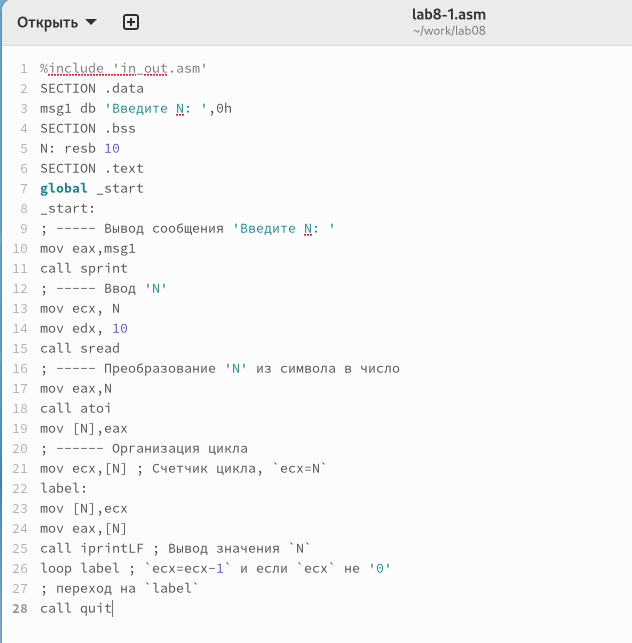
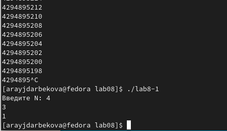
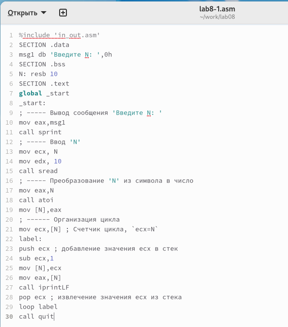
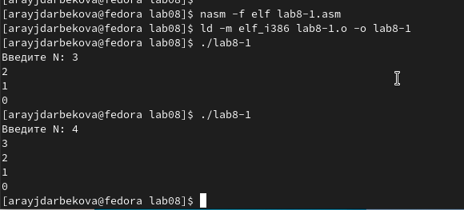
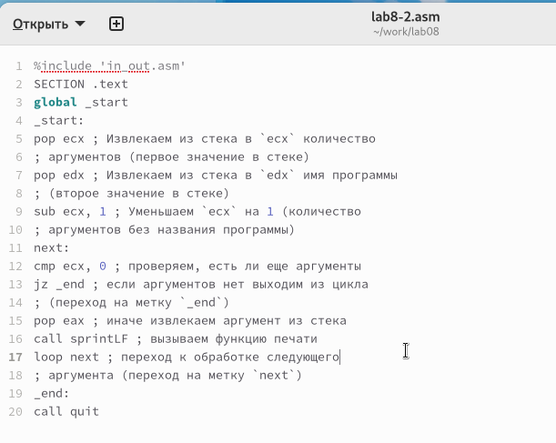
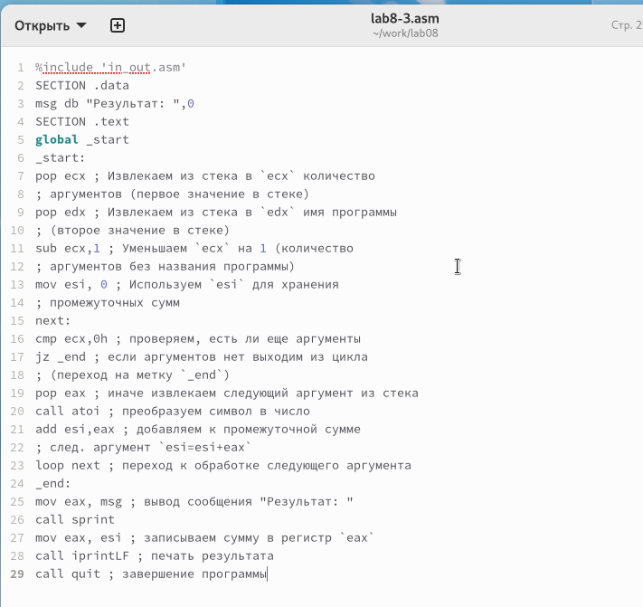
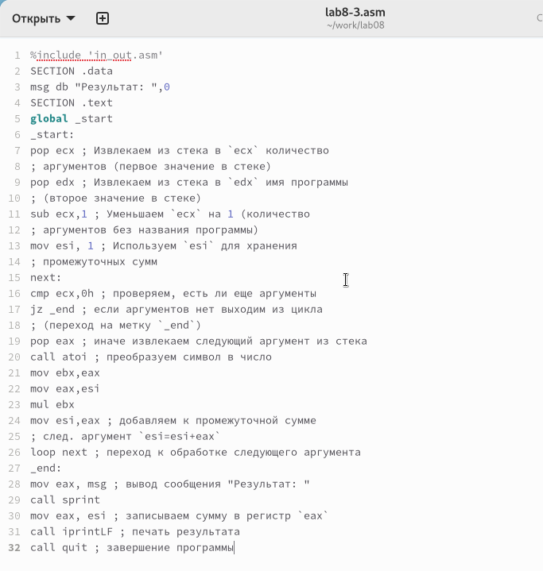
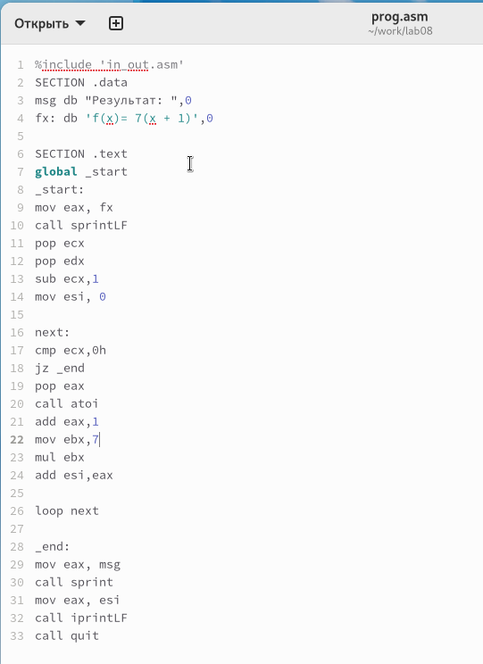
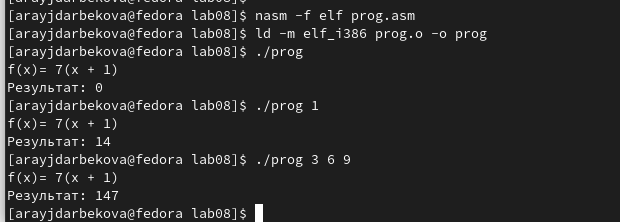

---
## Front matter
title: "Отчёт по лабораторной работе 8"
subtitle: "Дисциплина: архитектура компьютера"
author: "Айдарбекова Алия НММбд-01-23"

## Generic otions
lang: ru-RU
toc-title: "Содержание"

## Bibliography
bibliography: bib/cite.bib
csl: pandoc/csl/gost-r-7-0-5-2008-numeric.csl

## Pdf output format
toc: true # Table of contents
toc-depth: 2
lof: true # List of figures
lot: true # List of tables
fontsize: 12pt
linestretch: 1.5
papersize: a4
documentclass: scrreprt
## I18n polyglossia
polyglossia-lang:
  name: russian
  options:
	- spelling=modern
	- babelshorthands=true
polyglossia-otherlangs:
  name: english
## I18n babel
babel-lang: russian
babel-otherlangs: english
## Fonts
mainfont: PT Serif
romanfont: PT Serif
sansfont: PT Sans
monofont: PT Mono
mainfontoptions: Ligatures=TeX
romanfontoptions: Ligatures=TeX
sansfontoptions: Ligatures=TeX,Scale=MatchLowercase
monofontoptions: Scale=MatchLowercase,Scale=0.9
## Biblatex
biblatex: true
biblio-style: "gost-numeric"
biblatexoptions:
  - parentracker=trueЗырянов Артём Алексеевич	НБИбд-01-22

  - backend=biber
  - hyperref=auto
  - language=auto
  - autolang=other*
  - citestyle=gost-numeric
## Pandoc-crossref LaTeX customization
figureTitle: "Рис."
tableTitle: "Таблица"
listingTitle: "Листинг"
lofTitle: "Список иллюстраций"
lotTitle: "Список таблиц"
lolTitle: "Листинги"
## Misc options
indent: true
header-includes:
  - \usepackage{indentfirst}
  - \usepackage{float} # keep figures where there are in the text
  - \floatplacement{figure}{H} # keep figures where there are in the text
---

# Цель работы

Целью работы является приобретение навыков написания программ с использованием циклов и обработкой аргументов командной строки..

# Задание

1. Изучение цмклов в ассемблере

2. Изучение стека в ассемблере

3. Изучение передачи аргументов в ассемблере

4. Выполнение заданий, рассмотрение примеров

5. Выполнение заданий для самостоятельной работы

# Теоретическое введение

Стек — это структура данных, организованная по принципу LIFO («Last In — First Out»
или «последним пришёл — первым ушёл»). Стек является частью архитектуры процессора и
реализован на аппаратном уровне. Для работы со стеком в процессоре есть специальные
регистры (ss, bp, sp) и команды.

Команда push размещает значение в стеке, т.е. помещает значение в ячейку памяти, на
которую указывает регистр esp, после этого значение регистра esp увеличивается на 4.

Команда pop извлекает значение из стека, т.е. извлекает значение из ячейки памяти, на
которую указывает регистр esp, после этого уменьшает значение регистра esp на 4. У этой
команды также один операнд, который может быть регистром или переменной в памяти.

Для организации циклов существуют специальные инструкции. Для всех инструкций
максимальное количество проходов задаётся в регистре ecx. 
Наиболее простой является инструкция loop. Она позволяет организовать безусловный цикл.

# Выполнение лабораторной работы

## Реализация циклов в NASM

Создаю каталог для выполнения лабораторной работы № 8 и файл с именем lab8-1.asm. 

При использовании инструкции loop в NASM для реализации циклов, нужно помнить о том, 
что данная инструкция использует регистр ecx в качестве счетчика и на каждой итерации 
уменьшает его значение на единицу.

Рассмотрим пример программы, которая выводит значение регистра ecx. 
Написала текст программы из листинга 8.1 в файле lab8-1.asm. (рис. [-@fig:001])

{ #fig:001 width=70%, height=70% }

Затем создаю исполняемый файл и проверю его работу.(рис. [-@fig:002])

{ #fig:002 width=70%, height=70% }

В данном примере демонстрируется, что использование регистра ecx в инструкции loop 
может привести к неправильной работе программы. 
В тексте программы вношу изменения, которые включают изменение значения регистра 
ecx внутри цикла.(рис. [-@fig:003])

{ #fig:003 width=70%, height=70% }

Программа запускает бесконечный цикл при нечетном значении N и 
выводит только нечетные числа при четном значении N. (рис. [-@fig:004])

{ #fig:004 width=70%, height=70% }

Для того чтобы использовать регистр ecx в цикле и обеспечить корректность работы программы, 
применяется стек. Вношу изменения в текст программы, 
добавив команды push и pop для сохранения значения счётчика цикла loop в стеке.(рис. [-@fig:005])

{ #fig:005 width=70%, height=70% }

Был создан исполняемый файл и проверена его работа. 
Программа выводит числа от N-1 до 0, где 
количество проходов цикла соответствует значению N.(рис. [-@fig:006])

{ #fig:006 width=70%, height=70% }

## Обработка аргументов командной строки

Я создала файл lab8-2.asm в каталоге ~/work/arch-pc/lab08 
и ввела в него текст программы из листинга 8.2. (рис. [-@fig:007])

{ #fig:007 width=70%, height=70% }

Затем я создала исполняемый файл и запустила его, указав аргументы. 
Программа успешно обработала 5 аргументов. Аргументами считаются слова/числа, 
разделенные пробелом. (рис. [-@fig:008]

{ #fig:008 width=70%, height=70% }

Теперь рассмотрим ещё один пример программы, которая выводит сумму чисел, 
переданных в программу как аргументы командной строки. (рис. [-@fig:009]) (рис. [-@fig:010])

{ #fig:009 width=70%, height=70% }

{ #fig:010 width=70%, height=70% }

Я изменила текст программы из листинга 8.3 для вычисления произведения аргументов 
командной строки. (рис. [-@fig:011]) (рис. [-@fig:012])

{ #fig:011 width=70%, height=70% }

{ #fig:012 width=70%, height=70% }

## Выполнение заданий для самостоятельной работы

Напишите программу, которая находит сумму значений функции 
$f(x)$ для $x = x_1, x_2, ..., x_n$, т.е. программа должна выводить значение 
$f(x_1) + f(x_2)+ ... +f(x_n)$. 
Значения $x$ передаются как аргументы. 
Вид функции $f(x)$ выбрать из таблицы 8.1 вариантов заданий в соответствии с вариантом, 
полученным при выполнении лабораторной работы № 7. 
Создайте исполняемый файл и проверьте его работу на нескольких наборах $x$.(рис. [-@fig:013]) (рис. [-@fig:014])

Мой вариант 14: $$f(x) = 7(x + 1)$$ 

{ #fig:013 width=70%, height=70% }

{ #fig:014 width=70%, height=70% }

# Выводы

Освоили работы со стеком, циклом и аргументами на ассемблере nasm.