---
## Front matter
title: "Отчёт по лабораторной работе 9"
subtitle: "Дисциплина: архитектура компьютера"
author: "Айдарбекова Алия НММбд-01-23"

## Generic otions
lang: ru-RU
toc-title: "Содержание"

## Bibliography
bibliography: bib/cite.bib
csl: pandoc/csl/gost-r-7-0-5-2008-numeric.csl

## Pdf output format
toc: true # Table of contents
toc-depth: 2
lof: true # List of figures
lot: true # List of tables
fontsize: 12pt
linestretch: 1.5
papersize: a4
documentclass: scrreprt
## I18n polyglossia
polyglossia-lang:
  name: russian
  options:
	- spelling=modern
	- babelshorthands=true
polyglossia-otherlangs:
  name: english
## I18n babel
babel-lang: russian
babel-otherlangs: english
## Fonts
mainfont: PT Serif
romanfont: PT Serif
sansfont: PT Sans
monofont: PT Mono
mainfontoptions: Ligatures=TeX
romanfontoptions: Ligatures=TeX
sansfontoptions: Ligatures=TeX,Scale=MatchLowercase
monofontoptions: Scale=MatchLowercase,Scale=0.9
## Biblatex
biblatex: true
biblio-style: "gost-numeric"
biblatexoptions:
  - parentracker=true
  - backend=biber
  - hyperref=auto
  - language=auto
  - autolang=other*
  - citestyle=gost-numeric
## Pandoc-crossref LaTeX customization
figureTitle: "Рис."
tableTitle: "Таблица"
listingTitle: "Листинг"
lofTitle: "Список иллюстраций"
lotTitle: "Список таблиц"
lolTitle: "Листинги"
## Misc options
indent: true
header-includes:
  - \usepackage{indentfirst}
  - \usepackage{float} # keep figures where there are in the text
  - \floatplacement{figure}{H} # keep figures where there are in the text
---

# Цель работы

Целью работы является приобретение навыков написания программ с использованием подпрограмм.
Знакомство с методами отладки при помощи GDB и его основными возможностями.

# Задание

1. Изучение подпрограмм в ассемблере

2. Изучение функций отладчика GDB

3. Изучение передачи аргументов с помощью отладчика

4. Выполнение заданий, рассмотрение примеров

5. Выполнение заданий для самостоятельной работы

# Теоретическое введение

Отладка — это процесс поиска и исправления ошибок в программе. В общем случае его
можно разделить на четыре этапа:

* обнаружение ошибки;

* поиск её местонахождения;

* определение причины ошибки;

* исправление ошибки.

Наиболее часто применяют следующие методы отладки:

* создание точек контроля значений на входе и выходе участка программы (например, вывод промежуточных значений на экран — так называемые диагностические сообщения);

* использование специальных программ-отладчиков

GDB (GNU Debugger — отладчик проекта GNU) работает на многих UNIX-подобных
системах и умеет производить отладку многих языков программирования. GDB предлагает
обширные средства для слежения и контроля за выполнением компьютерных программ. Отладчик не содержит собственного графического пользовательского интерфейса и использует
стандартный текстовый интерфейс консоли. Однако для GDB существует несколько сторонних графических надстроек, а кроме того, некоторые интегрированные среды разработки
используют его в качестве базовой подсистемы отладки.

Подпрограмма — это, как правило, функционально законченный участок кода, который
можно многократно вызывать из разных мест программы. В отличие от простых переходов
из подпрограмм существует возврат на команду, следующую за вызовом.
Если в программе встречается одинаковый участок кода, его можно оформить в виде
подпрограммы, а во всех нужных местах поставить её вызов. При этом подпрограмма будет содержаться в коде в одном экземпляре, что позволит уменьшить размер кода всей
программы.

Для вызова подпрограммы из основной программы используется инструкция call, которая заносит адрес следующей инструкции в стек и загружает в регистр eip адрес соответствующей подпрограммы, осуществляя таким образом переход. Затем начинается выполнение
подпрограммы, которая, в свою очередь, также может содержать подпрограммы.

Подпрограмма завершается инструкцией ret, которая извлекает из стека адрес, занесённый туда соответствующей инструкцией call, и заносит его в eip. После этого выполнение
основной программы возобновится с инструкции, следующей за инструкцией call.

# Выполнение лабораторной работы

## Реализация подпрограмм в NASM

Для начала я создала новую директорию и перешла в нее, чтобы выполнить 
лабораторную работу номер 9. Затем я создала файл с именем lab9-1.asm.

В качестве примера рассмотрим программу, которая вычисляет арифметическое 
выражение f(x) = 2x + 7 с использованием подпрограммы calcul. 
В данном примере значение переменной x вводится с клавиатуры, 
а само выражение вычисляется внутри подпрограммы. (рис. [-@fig:001]) (рис. [-@fig:002])

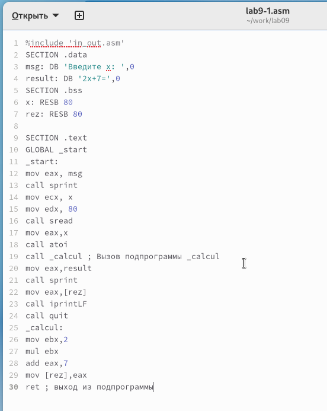{ #fig:001 width=70%, height=70% }

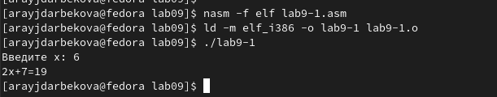{ #fig:002 width=70%, height=70% }

После этого я внесла изменения в текст программы, добавив подпрограмму 
subcalcul внутрь подпрограммы calcul. Это позволяет вычислить составное 
выражение f(g(x)), где значение x также вводится с клавиатуры. Функции 
определены следующим образом: f(x) = 2x + 7, g(x) = 3x - 1. (рис. [-@fig:003]) (рис. [-@fig:004])

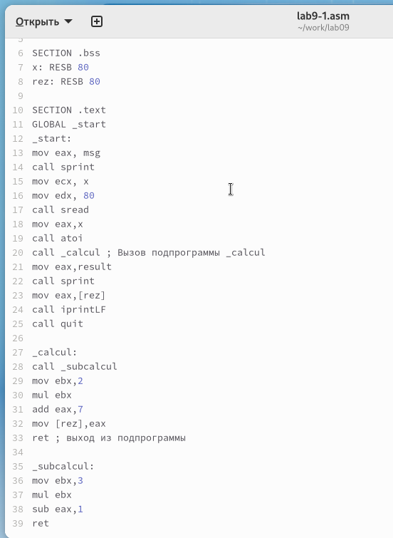{ #fig:003 width=70%, height=70% }

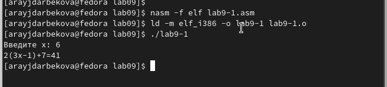{ #fig:004 width=70%, height=70% }

## Отладка программам с помощью GDB

Я создала файл с именем lab9-2.asm и внесла в него текст программы из Листинга 9.2. 
Эта программа предназначена для вывода сообщения "Hello world!". (рис. [-@fig:005])

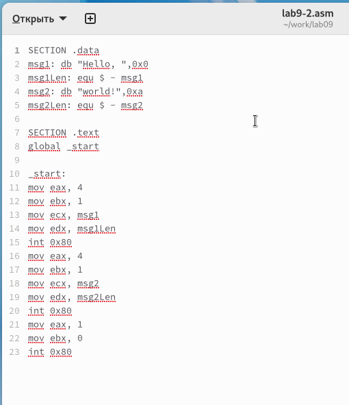{ #fig:005 width=70%, height=70% }

Далее я скомпилировала файл и получила исполняемый файл. 
Чтобы добавить отладочную информацию для работы с отладчиком GDB, использовала 
ключ "-g".

Затем загрузила полученный исполняемый файл в отладчик GDB и проверила его 
работу, запустив программу с помощью команды "run" или "r".(рис. [-@fig:006])

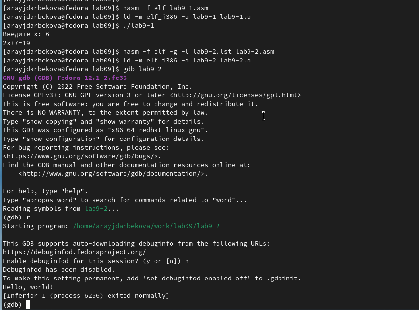{ #fig:006 width=70%, height=70% }

Для более детального анализа программы я установила точку остановки на 
метке "start", с которой начинается выполнение любой ассемблерной программы, 
и запустила ее. Затем просмотрела дизассемблированный код программы. (рис. [-@fig:007]) (рис. [-@fig:008])

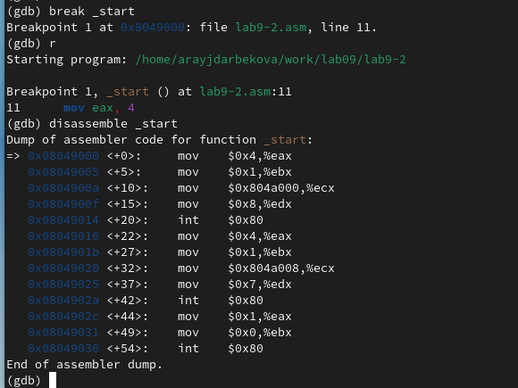{ #fig:007 width=70%, height=70% }

{ #fig:008 width=70%, height=70% }

Чтобы проверить точку остановки по имени метки "_start", 
я использовала команду "info breakpoints" или "i b". Затем установила еще 
одну точку остановки по адресу инструкции, определив адрес предпоследней 
инструкции "mov ebx, 0x0" (рис. [-@fig:009])

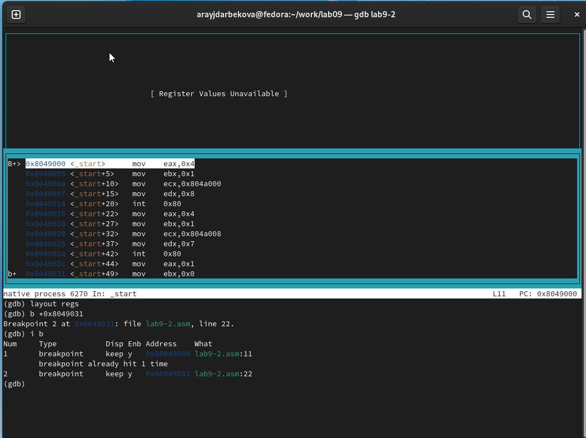{ #fig:009 width=70%, height=70% }

В отладчике GDB я могу просматривать содержимое ячеек памяти и регистров, 
а также изменять значения регистров и переменных. 
Я выполнила 5 инструкций с помощью команды 'stepi' (сокращенно 'si') 
и отследила изменение значений регистров. (рис. [-@fig:010]) (рис. [-@fig:011])

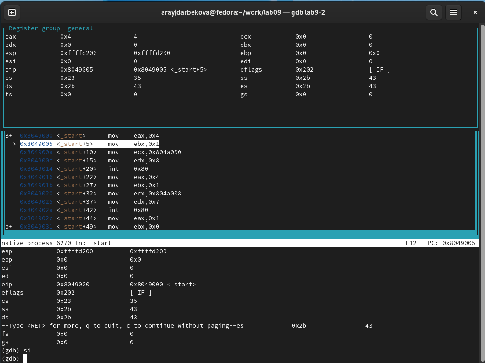{ #fig:010 width=70%, height=70% }

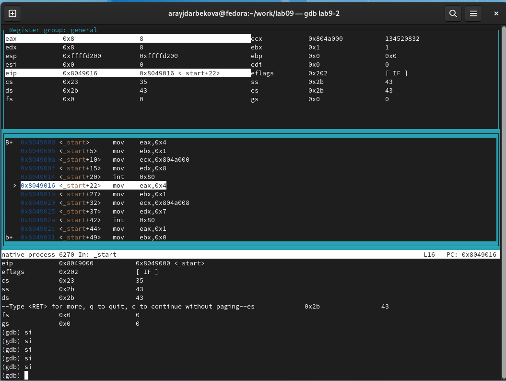{ #fig:011 width=70%, height=70% }

Для просмотра значения переменной msg1 по имени и получения нужных данных, использовала соответствующую команду.

Для изменения значения регистра или ячейки памяти, использовала команду set, 
указав имя регистра или адрес в качестве аргумента. (рис. [-@fig:012])

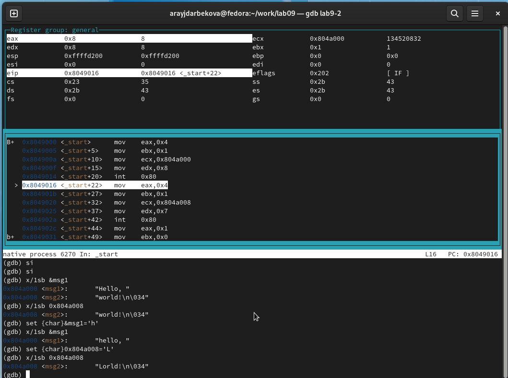{ #fig:012 width=70%, height=70% }

Я успешно изменила первый символ переменной msg1.(рис. [-@fig:013])

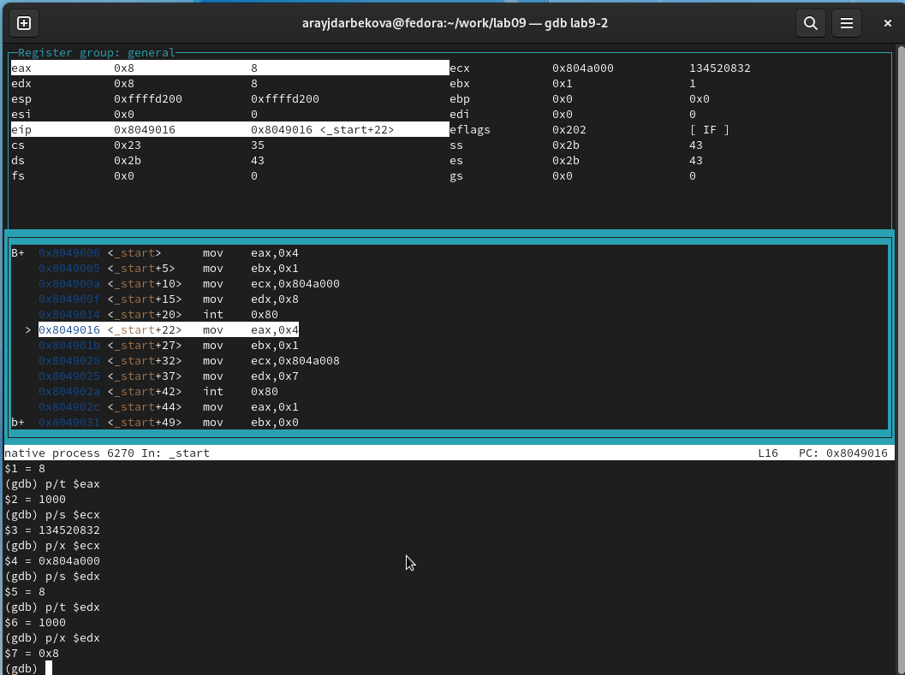{ #fig:013 width=70%, height=70% }

Также, с помощью команды set, я изменила значение регистра ebx на нужное значение. (рис. [-@fig:014])

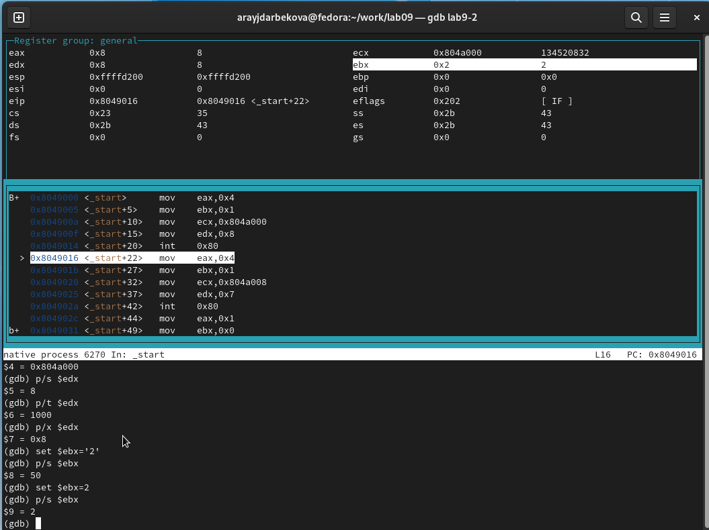{ #fig:014 width=70%, height=70% }

Я скопировала файл lab8-2.asm, который был создан во время выполнения 
лабораторной работы №8. Этот файл содержит программу для вывода аргументов 
командной строки. Затем создала исполняемый файл из скопированного файла.

Для загрузки программы с аргументами в gdb использовала ключ --args и загрузила 
исполняемый файл в отладчик с указанными аргументами.
Я установила точку останова перед первой инструкцией программы и запустила ее.

Адрес вершины стека, где хранится количество аргументов командной строки 
(включая имя программы), хранится в регистре esp. По этому адресу я нашла число, 
указывающее количество аргументов. В данном случае увидела, что количество 
аргументов равно 5, включая имя программы lab9-3 и сами аргументы: аргумент1, 
аргумент2 и 'аргумент 3'.

Я также просмотрела остальные позиции стека. По адресу [esp+4] находится 
адрес в памяти, где располагается имя программы. По адресу [esp+8] 
хранится адрес первого аргумента, по адресу [esp+12] - второго и так далее.
Шаг изменения адреса равен 4, так как каждый следующий адрес на стеке находится 
на расстоянии 4 байт от предыдущего ([esp+4], [esp+8], [esp+12]). (рис. [-@fig:015])

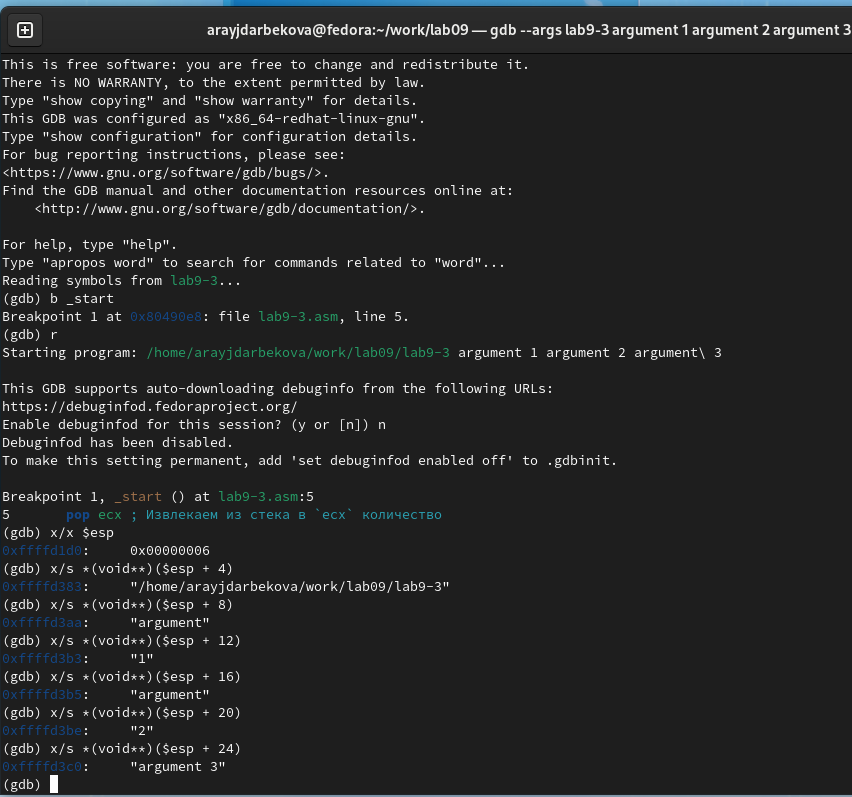{ #fig:015 width=70%, height=70% }

## Задание для самостоятельной работы

Я переписала программу из лабораторной работы №8, задание №1, 
чтобы реализовать вычисление значения функции f(x) как подпрограмму. (рис. [-@fig:016]) (рис. [-@fig:017])

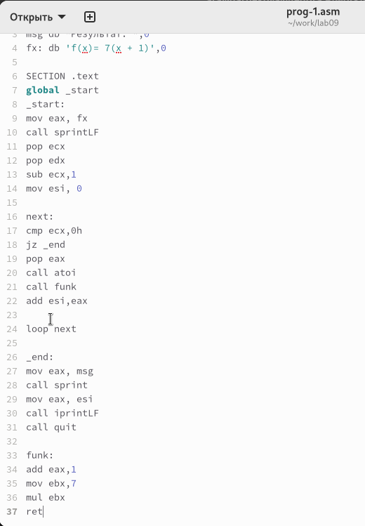{ #fig:016 width=70%, height=70% }

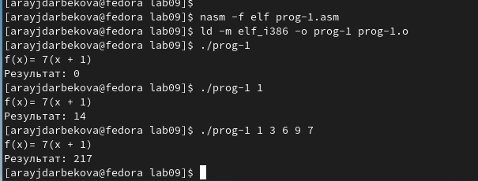{ #fig:017 width=70%, height=70% }

Приведенный ниже код представляет программу для вычисления выражения $(3+2)*4+5$. 
Однако, при запуске программа дает неверный результат. 

Я провела анализ изменений значений регистров с помощью отладчика GDB и 
обнаружила ошибку: перепутан порядок аргументов у инструкции add.
 Кроме того, заметила, что по окончании работы в регистр edi передается значение 
 ebx вместо eax.(рис. [-@fig:018]) (рис. [-@fig:019])

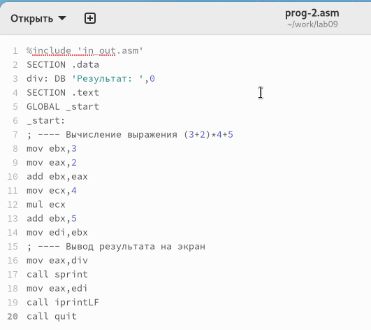{ #fig:018 width=70%, height=70% }

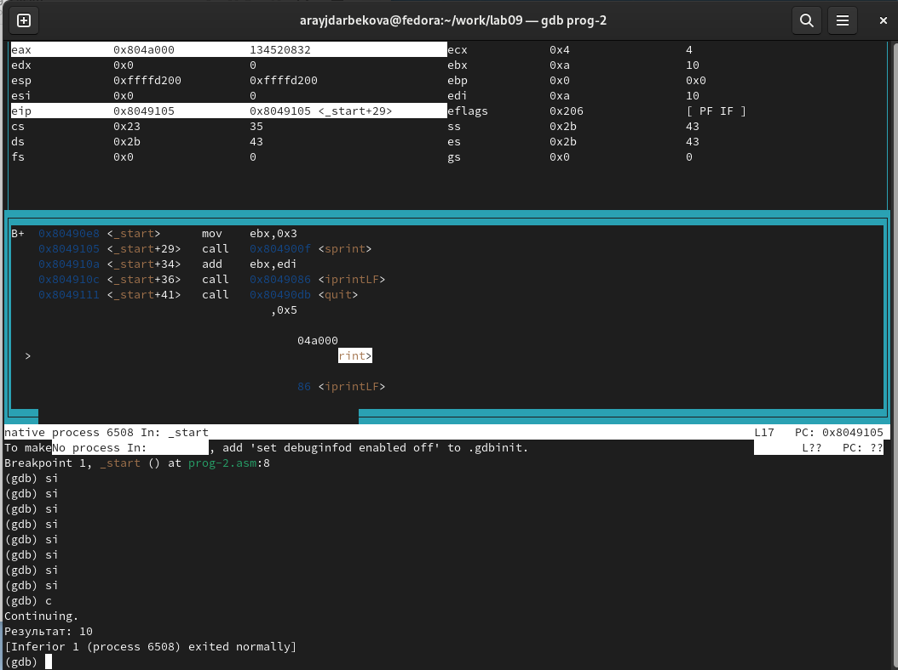{ #fig:019 width=70%, height=70% }

Я исправила код программы, учитывая перепутанный порядок аргументов у инструкции add 
и правильную передачу значения в регистр edi по окончании работы программы. (рис. [-@fig:020]) (рис. [-@fig:021])

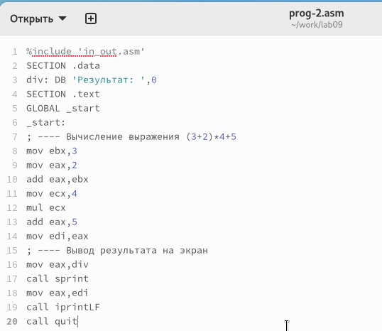{ #fig:020 width=70%, height=70% }

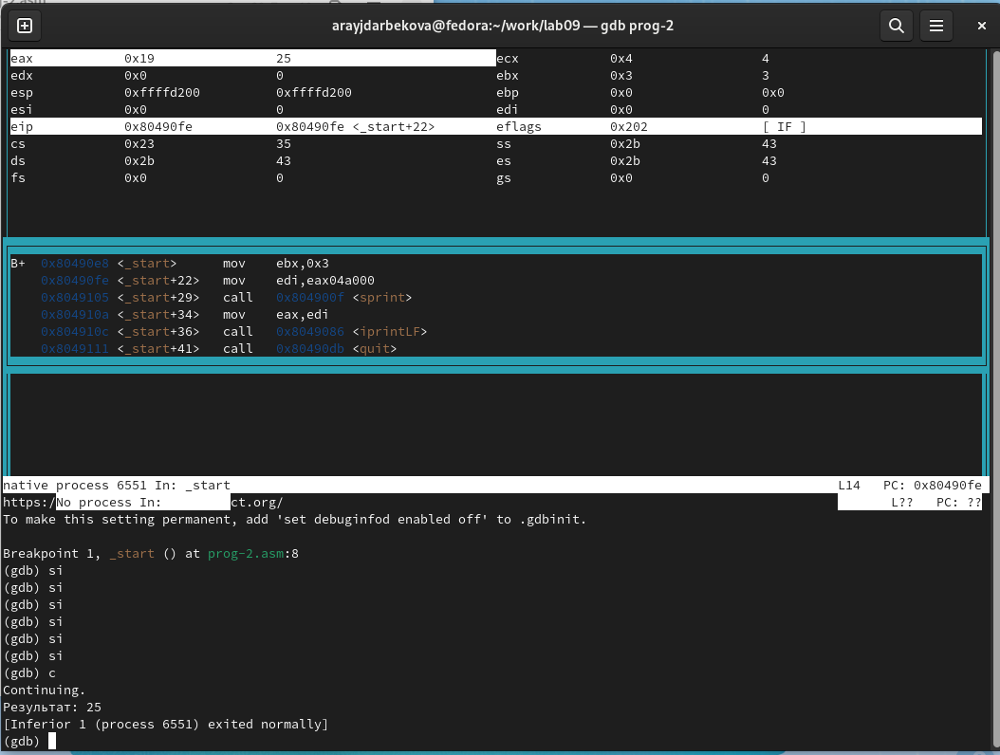{ #fig:021 width=70%, height=70% }

# Выводы

Освоили работy с подпрограммами и отладчиком.