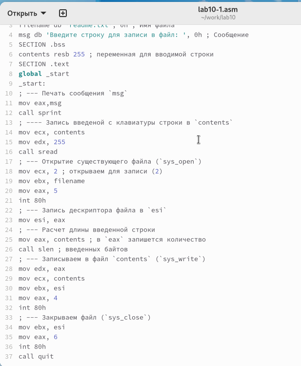
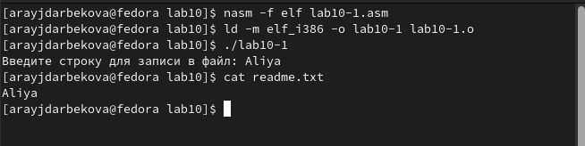
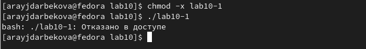
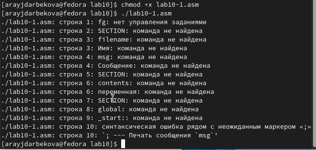
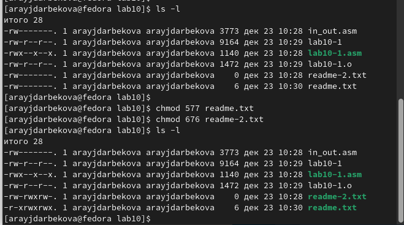
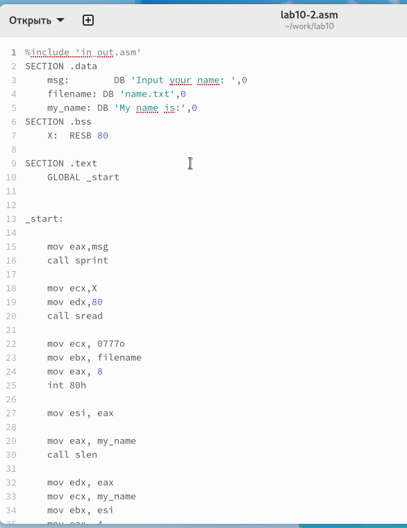
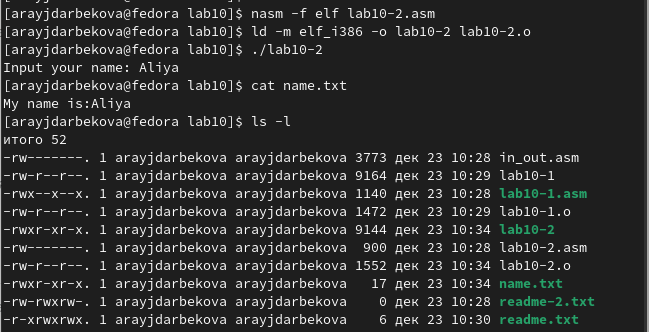

---
## Front matter
title: "Отчёт по лабораторной работе 10"
subtitle: "Дисциплина: архитектура компьютера"
author: "Айдарбекова Алия НММбд-01-23"

## Generic otions
lang: ru-RU
toc-title: "Содержание"

## Bibliography
bibliography: bib/cite.bib
csl: pandoc/csl/gost-r-7-0-5-2008-numeric.csl

## Pdf output format
toc: true # Table of contents
toc-depth: 2
lof: true # List of figures
lot: true # List of tables
fontsize: 12pt
linestretch: 1.5
papersize: a4
documentclass: scrreprt
## I18n polyglossia
polyglossia-lang:
  name: russian
  options:
	- spelling=modern
	- babelshorthands=true
polyglossia-otherlangs:
  name: english
## I18n babel
babel-lang: russian
babel-otherlangs: english
## Fonts
mainfont: PT Serif
romanfont: PT Serif
sansfont: PT Sans
monofont: PT Mono
mainfontoptions: Ligatures=TeX
romanfontoptions: Ligatures=TeX
sansfontoptions: Ligatures=TeX,Scale=MatchLowercase
monofontoptions: Scale=MatchLowercase,Scale=0.9
## Biblatex
biblatex: true
biblio-style: "gost-numeric"
biblatexoptions:
  - parentracker=true
  - backend=biber
  - hyperref=auto
  - language=auto
  - autolang=other*
  - citestyle=gost-numeric
## Pandoc-crossref LaTeX customization
figureTitle: "Рис."
tableTitle: "Таблица"
listingTitle: "Листинг"
lofTitle: "Список иллюстраций"
lotTitle: "Список таблиц"
lolTitle: "Листинги"
## Misc options
indent: true
header-includes:
  - \usepackage{indentfirst}
  - \usepackage{float} # keep figures where there are in the text
  - \floatplacement{figure}{H} # keep figures where there are in the text
---

# Цель работы

Целью работы является приобретение навыков написания программ для работы с файлами.

# Задание

1. Изучение работы с файлами в ассемблере

2. Изучение примеров программ 

3. Изучение прав доступа

4. Выполнение заданий для самостоятельной работы

# Теоретическое введение

ОС GNU/Linux является многопользовательской операционной системой. И для обеспечения 
защиты данных одного пользователя от действий других пользователей существуют
специальные механизмы разграничения доступа к файлам. Кроме ограничения доступа, 
данный механизм позволяет разрешить другим пользователям доступ данным для совместной
работы.

Права доступа определяют набор действий (чтение, запись, выполнение), разрешённых
для выполнения пользователям системы над файлами. Для каждого файла пользователь
может входить в одну из трех групп: владелец, член группы владельца, все остальные. 
Для каждой из этих групп может быть установлен свой набор прав доступа. 
Владельцем файла является его создатель.

Набор прав доступа задается тройками битов и состоит из прав на чтение, запись и 
исполнение файла. В символьном представлении он имеет вид строк rwx, где вместо 
любого символа может стоять дефис. Всего возможно 8 комбинаций, приведенных в 
таблице 10.1. Буква означает наличие права (установлен в единицу второй бит триады 
r — чтение, первый бит w — запись, нулевой бит х — исполнение), а дефис означает 
отсутствие права (нулевое значение соответствующего бита). 
Также права доступа могут быть представлены как восьмеричное число. 
Так, права доступа rw- (чтение и запись, без исполнения) понимаются как три двоичные цифры 110 или как восьмеричная цифра 6.

Обработка файлов в операционной системе Linux осуществляется за счет использования
определенных системных вызовов. Для корректной работы и доступа к файлу при его от-
крытии или создании, файлу присваивается уникальный номер (16-битное целое число) –
дескриптор файла

# Выполнение лабораторной работы

Я организовала каталог для лабораторной работы №10 и перешла в него. Внутри каталога, мною были созданы три файла: lab10-1.asm, readme-1.txt и readme-2.txt. 

В файле lab10-1.asm, я разработала программу в соответствии с листингом 10.1, которая записывает сообщение в файл. После этого, я преобразовала этот код в исполняемый файл и проверила его функционирование.(рис. [-@fig:001]) 

{ #fig:001 width=70%, height=70% }

Эта программа запрашивает строку и перезаписывает её в файл readme.txt. 
Однако, если указанный файл не существует, строка не будет сохранена нигде.(рис. [-@fig:002]) (рис. [-@fig:002])

{ #fig:002 width=70%, height=70% }

Для того чтобы отменить выполнение исполняемого файла lab10-1, я применила команду chmod для изменения прав доступа. Я убрала атрибут "x" во всех трех позициях. После этого, я попыталась запустить файл. 

Но файл не запускался, так как атрибут "x" был отсутствовал во всех трех позициях, что запрещало его выполнение. (рис. [-@fig:003])

{ #fig:003 width=70%, height=70% }

Я изменила настройки доступа к файлу lab10-1.asm, добавив разрешение на его выполнение с использованием команды chmod. После этого, я попыталась запустить файл. (рис. [-@fig:004])

В итоге, файл был активирован, и терминал попытался интерпретировать его содержание как команды командной строки. Однако, поскольку это файл с кодом на языке ассемблера, а не команды для терминала, произошли ошибки. Но, если в такой файл внести команды командной строки, то их можно будет выполнить, запустив файл.

{ #fig:004 width=70%, height=70% }

Затем, я настроила права доступа к файлам readme в соответствии с указаниями в таблице 10.4. Чтобы убедиться в правильности выполнения, я применила команду ls -l. (рис. [-@fig:005])

для варианта 14: ```r-x rwx rwx``` ```110 111 110```

{ #fig:005 width=70%, height=70% }

## Задание для самостоятельной работы

Написала программу работающую по следующему алгоритму (рис. [-@fig:006]) (рис. [-@fig:007]):

* Вывод приглашения “Как Вас зовут?”

* ввести с клавиатуры свои фамилию и имя

* создать файл с именем name.txt

* записать в файл сообщение “Меня зовут”

* дописать в файл строку введенную с клавиатуры

* закрыть файл

{ #fig:006 width=70%, height=70% }

{ #fig:007 width=70%, height=70% }

# Выводы

Освоили работy с файлами и правами доступа.